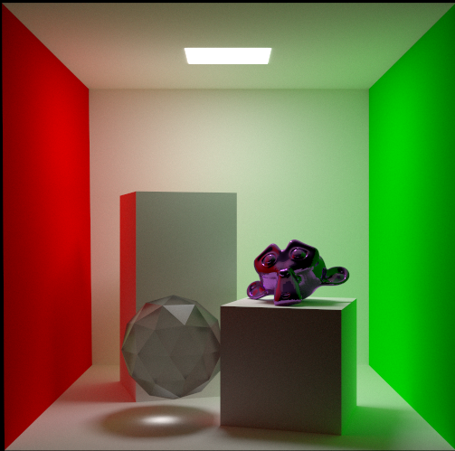

# Path Tracing Renderer - Advanced Computer Graphics at Mississppi State University - Assignment 4

## Overview

This project is a path tracing renderer that loads OBJ files and uses path tracing to render scenes with diffuse, refractive, and conductive BRDFs. It aims to provide a realistic simulation of light interaction with various materials by implementing advanced rendering techniques.

## Features

The renderer supports several modes of operation, allowing users to experiment with different rendering techniques and visualize their effects on the scene:

- **Importance Sampling**: Toggles the use of importance sampling for diffuse reflections, which helps to focus sampling in directions that contribute more significantly to the final image.

- **Direct Lighting**: Enables or disables direct lighting calculations, allowing for comparisons between purely indirect illumination and scenes that include direct light contributions.

- **Bounce Control**: Adjusts the maximum number of bounces for rays, enabling users to balance between render quality and performance.

### Added Features

- **Rough Metal BRDF**
- **Rough Dieltric BRDF**

  

  

## Modes of Operation
**Metallic Roughness** Adjust the metallic roughness with the `c` and `v` keys.  `v` increases the roughness, `c` decreases it.

**Dielectric Roughness** Adjust the dieltric roughness with the `z` and `x` keys.  `x` increases the roughness, `z` decreases it.

  **Importance Sampling Toggle**: Press the `1` key to toggle importance sampling on or off.
  
  *Importance Sampling off*

  

  *Importance Sampling on*

**Direct Lighting Toggle**: Press the `0` key to toggle direct lighting on or off.

*With Direct Lighting*

  

**Increase Bounces**: Press the `Up` arrow to increase the number of bounces up to a maximum of 28. This can enhance the realism of the rendering by allowing light to interact with more surfaces.

*16 Bounces*

**Decrease Bounces**: Press the `Down` arrow to decrease the number of bounces to a minimum of 1. This mode can be useful for quick previews or when performance is a priority.

*3 Bounces*

